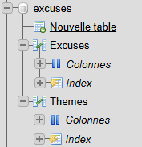
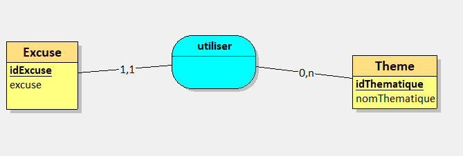
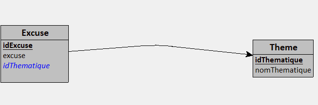
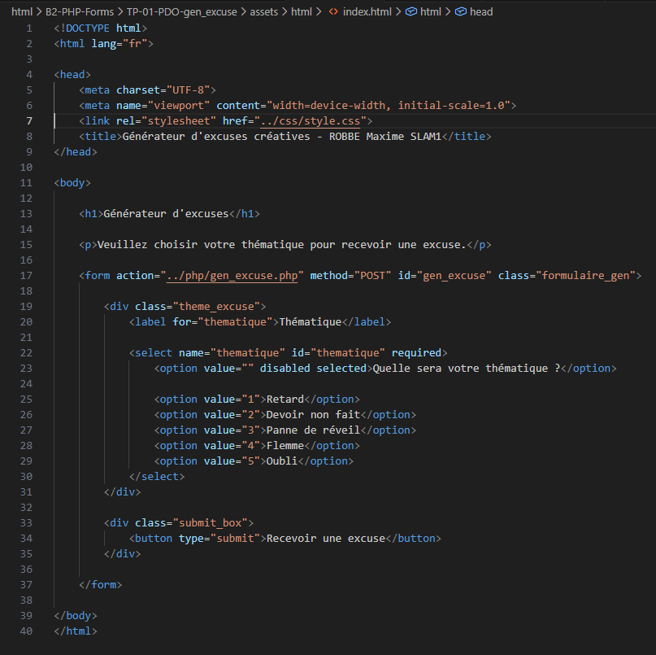
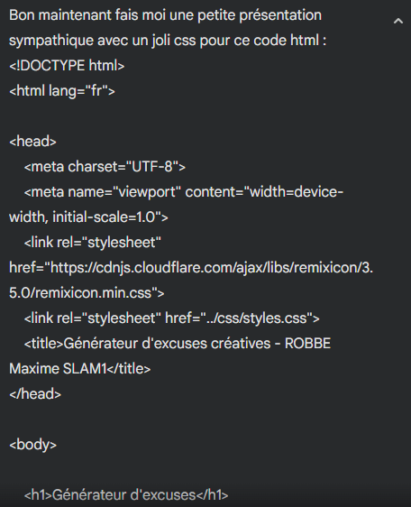

# Rapport TP1 PDO Générateur d'excuse ROBBE Maxime SLAM 1

# Partie 1 Création de la base de donnée

### Réalisation de la base de donnée "excuses" 

### Création de notre schéma MCD

J'ai créer mon schéma de la base de donnée. J'ai relié Excuses avec Themes en utilisant une association utiliser ou j'ai placer la clé primaire de Excuses dedans

### Comment nos deux tables sont-elles reliées ?

Les deux tables de notre base de données sont liés à l'aide d'une association utiliser pour que l'excuse prennent un theme qu'on à dans notre base de donnée.
La table Excuse et lié avec notre association utiliser par un lien "1.1" puis notre table Theme et elle lié à notre association par un lien "0.n".

## Création du dossier de travail "GenerateurExcusesCreatives

### Quel est le chemin pour accéder à ce dossier racine ?

Le chemin pour accéder à ce dossier racine est : /var/www/html/B2-PHP-Forms/TP-01-PDO-gen_excuse/GenerateurExcusesCreatives

On peut aussi utiliser le chemin relatif : 
html/B2-PHP-Forms/TP-01-PDO-gen_excuse/GenerateurExcusesCreatives

### Comment nomme-t-on ce dossier en anglais ? 

On nomme ce dossier le "root" qui signifie racine en anglais.

## Création des dossiers et des sous-dossiers pour une arborescence propre

On va créer nos dossiers pour stocker tout nos fichiers qui vont héberger notre site de générateur d'excuse.

Je crée donc un dossier assets dans lequel je crée des sous dossiers pour chaque language de programmation que je vais utiliser dans mon générateur d'excuse.

Je crée donc un dossier html, css et php pour pouvoir par la suite avoir une page web bien organisée.

## Création du fichier HTML et CSS

Je préfère commencer par mon fichier html pour me donner une idée de comment j'aimerais présenter la page. 

D'ailleurs j'ai utilisé Google Gemini pour faire un css simple et rapide pour rendre le fichier html joli, voici le prompt que j'ai utilisé pour le faire : 

## Création du fichier PHP

Après avoir crée le fichier html et l'avoir rempli je décide de m'attaquer au fichier php qui va lui me demander plus de refléxion pour le rendre utilisable.

J'ai énormément utilisé le cours pour créer le fichier php et j'ai demandé de l'aide à Google Gemini pour m'expliquer ou me ré expliquer certaines notions du cours surtout pour me connecter à la base de donnée avec le fichier php mais j'ai réussi après quelques éssais.

Pour faire fonctionner le script que j'ai réalisé j'ai fait majoritairement des tests à l'aide d'anciens cours que j'avais de cette année et j'ai assemblé les morceaux afin d'obtenir un code qui arrivait à me donner les résultats que j'attendais.

Je me suis aidé de Gemini pour me créer une variable qui me permettait de m'afficher les erreurs que je rencontré lors de la programmation du script php car je rencontrais des soucis pour me connecter à la base et des soucis pour faire sortir les réponses des excuses ainsi que de la sélection des thématiques. J'ai par la suite rajouté des commentaires de certains exemples que j'ai rencontré lors du projet.:

} catch (PDOException $erreur) {
    // En cas de panne moteur (connexion échouée, table inexistante, etc.)
    // On affiche le détail technique pour débugger
    $message = 'ERREUR PDO dans ' . $erreur->getFile() . ' : ' . $erreur->getLine() . ' : ' . $erreur->getMessage();
    die($message);

Puis quand tout fonctionné j'ai demandé à Gemini de me rajouter des protections pour les failles XSS dans mon code :

  // On protège le texte contre les failles XSS avec htmlspecialchars
            $excuse_a_afficher = htmlspecialchars($resultat['excuse']);

Quand tout fonctionné j'ai décidé de m'attaquer au style de la page d'affichage de l'excuse et j'ai appris que je pouvais faire du HTML + CSS dans du php c'est donc ce que j'ai fais avec l'assistance de Gemini pour avoir un rendu sympa et qui pique pas trop les yeux. Voila le prompt que je lui ai donné pour qu'il me le fasse :

Ok tu pourrais me faire le css et l'html de mon code du coup ? Et si tu peux me rajouter l'option de pouvoir passer entre mode sombre et clair se serait parfait !

Réponse aux questions du TP : 

Comment allez vous récupérer les paramètres du script PHP ?

Pour récupérer les paramètres du script on utilise un formulaire en post puis on utilise la commande : 
if (isset($_POST['thematique'])) {
        $idTheme = $_POST['thematique'];

Pour ajouter une excuse à notre base de donnée on va utiliser un deuxieme formulaire qui lui va aussi se connecter à notre base de donnée pour ajouter des excuses dans les thèmes qu'on va séléctionner : 

`$query = "INSERT INTO Excuses (idThematique, excuse) VALUES (?, ?)";`

`$result = mysql('excuses', $query, [$thematique, $excuse]);`

Question Bonus : 

Pour afficher toutes les excuses de chaque thème on peut faire la commande PHP suivante 

Pour créer un menu de navigation on peut soit le faire en utilisant uniquement de l'HTML pour juste qu'on regarde les excuses de chaque thème qu'on va séléctionner : 

